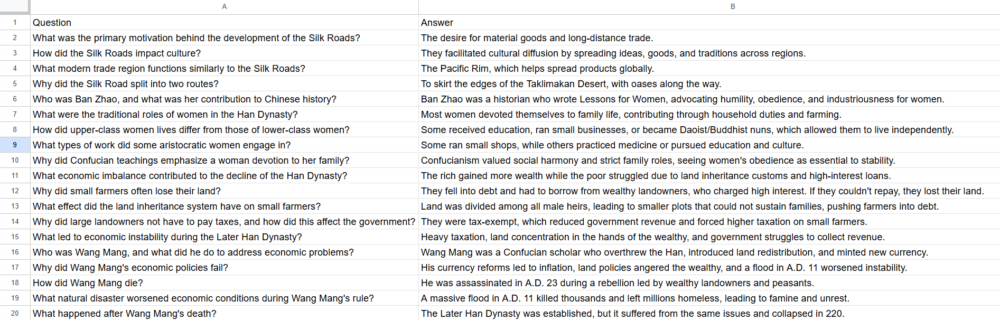

Make an AI image generator to produce an ML image as a sort of cover for this page

# Learning NLP:
The goal of this project is to create a program that can learn from a textbook and answer user queries based on the textbook.

Some things I learned through this project:

Vectorizer vs Tokenizer - A tokenizer simply splits a sentence or phrase into all the words (can also include punctuation based on Tokenizer params). A vectorizer on the other hand, takes these tokens and converts them into numbers that an ML model can understand, as it can not predict using Strings.

# Milestones: 

<a href = "./M1Codes.html">Milestone 1</a>: Creating the dataset to be used for the model.
In milestone 1, the dataset is loaded with a file of a textbook which is split up, allowing relevant sections to be processed together. On top of that, the text from each pdf is pulled, with the splitting of the dataset allowing each text's to fall under the limit of text uploadable to the LLM used. This is another benefit of splitting the dataset. Each text is seperately uploaded to the LLM to generate as many questions and answers from it to build a dataset for the textbook. Before diving into making actual datasets, I created a toy dataset of questions and answers (first 20 pairs in dataset shown below).

<a href = "./M2Codes.html">Milestone 2</a>: Making a base model (first version) for the dataset to answer questions on the same topics from the dataset.
In milestone 2, the dataset of questions and answers created during milestone 1 is used to a train an LLM model. This LLM model then uses that data to be able to answer the queries inputted about the textbook.

<a href = "./M3Codes.html">Milestone 3/ Final Milestone</a>: Refining the model continuously until it can answer all user given questions with a high accuracy.

